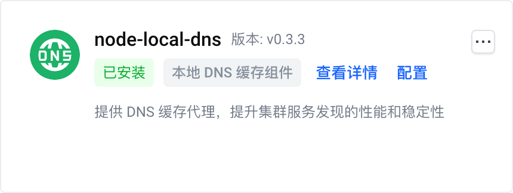
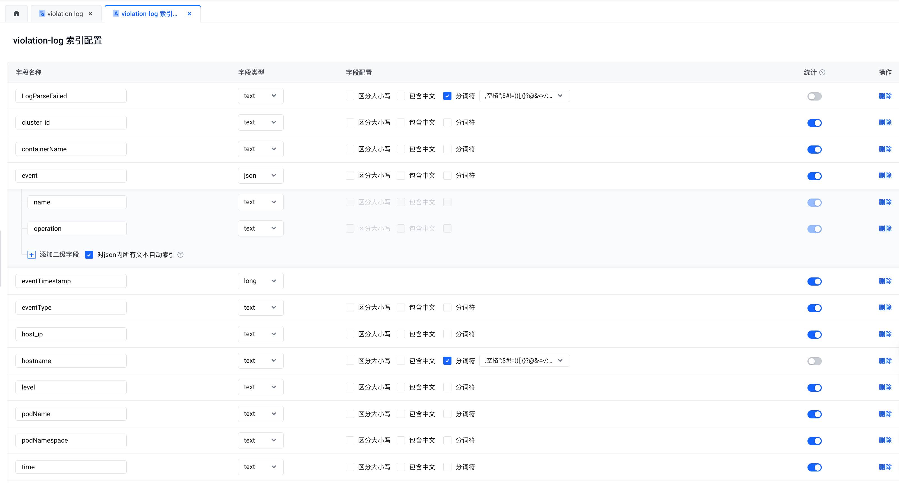
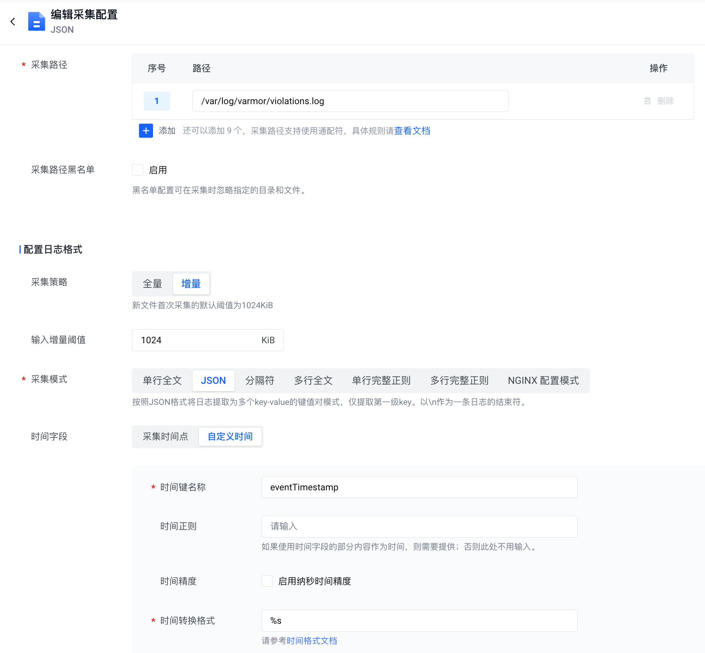
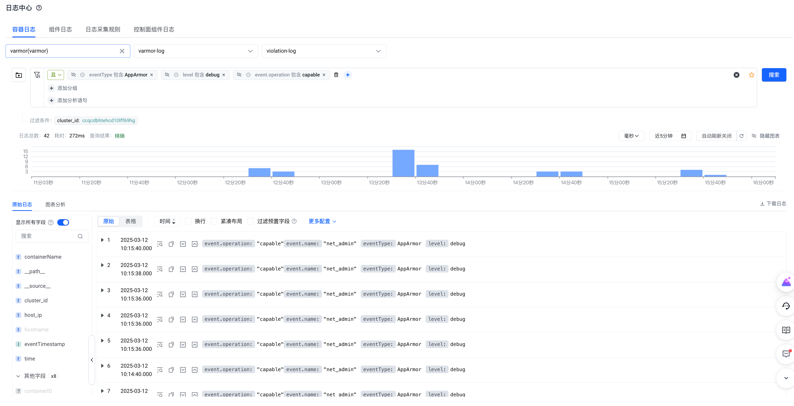
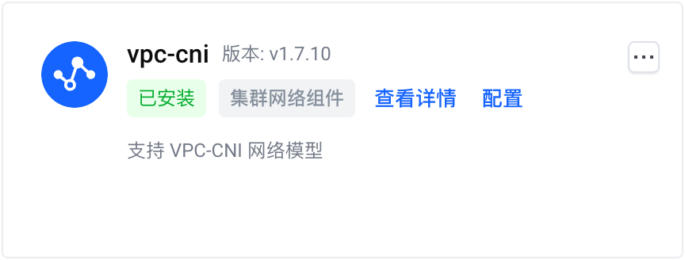

我们在[应用实践](https://www.varmor.org/zh-cn/docs/main/practices/)中简要介绍了 vArmor 的应用场景。在“特权容器加固”方面，面对“企业难以遵循最小权限原则将特权容器降权”的难题，我们提到可以使用 vArmor 的实验功能——行为建模模式来辅助降权。
本文将向您详细介绍移除特权容器的必要性、面临的挑战和方法。并结合实际案例向您演示如何借助 vArmor 的行为建模和观察模式特性来辅助特权容器降权，从而帮助企业提升云原生环境的安全水位。

<!-- truncate -->

## 为什么要减少特权容器

在云原生环境中，特权容器常指在 Pod 资源定义中 .spec.containers[].securityContext.privileged 为 true 的容器。这类容器有以下主要特点：

- 以 root 用户运行 & 拥有所有的 capability
- 拥有宿主机所有设备的访问权限
- Seccomp Profile 不会生效，且缺少 AppArmor Profile 防护

许多研究报告和案例都阐明过使用“特权容器”的危害<sup><a href="#ref1">[1]</a></sup><sup><a href="#ref2">[2]</a></sup>。攻击者可以以它为跳板，使用多种手法进行攻击，最终将恶意代码或恶意软件传播到受感染的主机和网络。因此，企业应当尽可能地收敛特权容器的使用范围，基于最小权限原则授予容器所需的权限。

:::tip[说明]
减少系统组件中的特权容器也有积极意义。在一些场景中，攻击者会借助系统组件的 RCE 漏洞 & 特权容器进行渗透入侵。而移除其特权容器可以增加攻击者的难度与成本，并且有助于及时发现和响应攻击者的入侵行为。
:::

## 面临的挑战

- 企业可能因为历史原因，已经大量使用了特权容器。容器对应的服务、组件可能已处于维护状态不再迭代。维护人缺乏对目标原理的了解，贸然更改配置的风险较大。
- 容器化的系统组件往往需要一些特权才能正常工作，但现代操作系统和 runc 容器的权限管理复杂且精细，研发人员难以按照最小权限原则进行权限配置。
- 缺少帮助研发人员对特权容器进行降权的工具和方法。

## 使用 vArmor 辅助降权

### 适用范围
- 以下场景中的特权容器无法被降权
  - 容器使用了 Bidirectional 挂载传播属性进行卷挂载<sup><a href="#ref3">[3]</a></sup>
- 使用 AppArmor enforcer 进行行为建模时，集群节点需支持 AppArmor LSM，确认方法如下所示
  ```bash
  cat /sys/kernel/security/lsm | grep apparmor
  ```

### 方法描述

#### 1. 借助行为建模功能辅助降权

[BehaviorModeling 模式](https://www.varmor.org/zh-cn/docs/main/guides/policies_and_rules/policy_modes/behavior_modeling)是 vArmor 的一个实验功能。用户可以通过创建 BehaviorModeling 模式的 VarmorPolicy 或 VarmorClusterPolicy 策略对象，在指定时间范围对目标应用的容器进行行为建模。建模完成后，vArmor 将在一个 ArmorProfileModel 对象中保存目标应用的行为数据，以及基于行为数据生成的 AppArmor 或 Seccomp 安全策略。

行为建模的结果可以帮助安全和研发人员分析目标应用在运行过程中需要哪些特权能力（例如 net_admin capability）、读写了哪些系统文件（例如 /proc/sys/kernel/printk_ratelimit）等。并结合特权与非特权容器的差异，以最小权限原则为容器配置所需权限，从而实现降权。

#### 2. 借助观察模式辅助降权

当使用 EnhanceProtect 模式的 VarmorPolicy 或 VarmorClusterPolicy 策略对象来加固容器时，您还可以通过同时配置 `auditViolations: true` 和 `allowViolations: true` 来开启观察模式。由此一来，所有违反安全规则的行为都将被记录到 vArmor 的[审计日志](https://www.varmor.org/zh-cn/docs/main/getting_started/usage_instructions#%E5%AE%A1%E8%AE%A1%E6%97%A5%E5%BF%97)中。

我们可以利用此特性，配合 [`disable-cap-privileged`](https://www.varmor.org/zh-cn/docs/main/guides/policies_and_rules/built_in_rules/hardening#disable-cap-privileged) 或 [`disable-cap-all`](https://www.varmor.org/zh-cn/docs/main/guides/policies_and_rules/built_in_rules/hardening#disable-cap-all) 内置规则来监控并收集目标应用在运行过程中需要使用哪些能力（例如 net_admin capability），然后使用收集的数据来为容器配置所需权限，从而实现降权。

### 注意事项

#### 关注特权与非特权容器的差异
容器运行时组件（如 containerd、cri-o、dockerd）在处理“特权容器”与“非特权容器”时存在一些差异。因此当使用“非特权容器”运行组件时，可能需要额外配置来确保组件能够正常运行。

* **默认的 capabilities**

  为了提高兼容性，容器运行时组件会默认授予非特权容器以下非特权能力<sup><a href="#ref4">[4]</a></sup>，除此以外的特权能力需要通过 `securityContext.capabilities.add` 来添加。

  ```
  AUDIT_WRITE
  CHOWN
  DAC_OVERRIDE
  FOWNER
  FSETID
  KILL
  MKNOD
  NET_BIND_SERVICE
  SETFCAP
  SETGID
  SETPCAP
  SETUID
  SYS_CHROOT
  ```

* **默认的 AppArmor Profile**

  当操作系统开启 AppArmor LSM 时，容器运行时组件将为“非特权容器”自动配置一个默认的 AppArmor Profile<sup><a href="#ref5">[5]</a></sup><sup><a href="#ref6">[6]</a></sup>。虽然默认的 AppArmor Profile 配置粒度较粗，但它会禁用 mount、禁止写入部分系统文件。

  ```
    deny @{PROC}/* w,   # deny write for all files directly in /proc (not in a subdir)
    # deny write to files not in /proc/<number>/** or /proc/sys/**
    deny @{PROC}/{[^1-9],[^1-9][^0-9],[^1-9s][^0-9y][^0-9s],[^1-9][^0-9][^0-9][^0-9]*}/** w,
    deny @{PROC}/sys/[^k]** w,  # deny /proc/sys except /proc/sys/k* (effectively /proc/sys/kernel)
    deny @{PROC}/sys/kernel/{?,??,[^s][^h][^m]**} w,  # deny everything except shm* in /proc/sys/kernel/
    deny @{PROC}/sysrq-trigger rwklx,
    deny @{PROC}/mem rwklx,
    deny @{PROC}/kmem rwklx,
    deny @{PROC}/kcore rwklx,

    deny mount,

    deny /sys/[^f]*/** wklx,
    deny /sys/f[^s]*/** wklx,
    deny /sys/fs/[^c]*/** wklx,
    deny /sys/fs/c[^g]*/** wklx,
    deny /sys/fs/cg[^r]*/** wklx,
    deny /sys/firmware/** rwklx,
    deny /sys/devices/virtual/powercap/** rwklx,
    deny /sys/kernel/security/** rwklx,
  ```

  因此，当您的容器依赖 mount、需要写入上述系统文件时，您需要通过以下配置显式地禁用 AppArmor Profile，从而避免其操作被默认的 AppArmor Profile 拦截。

  ```yaml
  # 适用于 Kubernetes v1.30 以下版本
  metadata:
    annotations:
      container.apparmor.security.beta.varmor.org/CONTAINER_NAME: unconfined
    
  # 适用于 Kubernetes v1.30 及以上版本
  spec：
    containers:
    - securityContext:
        appArmorProfile:
          type: Unconfined
  ```

* **默认的 maskedPaths & readonlyPaths**

  遵循 OCI 标准的容器运行时组件会默认将非特权容器 proc 文件系统内的部分文件、目录设置成屏蔽（不可读）、只读模式，从而将它们与宿主机隔离<sup><a href="#ref7">[7]</a></sup>。文件列表如下所示：

  - Masked Paths
    ```
    /proc/asound
    /proc/acpi
    /proc/kcore
    /proc/keys
    /proc/latency_stats
    /proc/timer_list
    /proc/timer_stats
    /proc/sched_debug
    /proc/scsi
    /sys/firmware
    /sys/devices/virtual/powercap
    ```

  - Read-Only Paths

    ```
    /proc/bus
    /proc/fs
    /proc/irq
    /proc/sys
    /proc/sysrq-trigger
    ```

  如果您的系统组件需要读写以上文件，那么可以通过下面的方法（二选一）绕过限制：
  * 使用 securityContext 中的 procMount（需要开启 Kubernetes 的 ProcMountType 特性）
  * 将宿主机 procfs 显式地挂载进容器

#### 尽可能收集数据

无论是使用行为建模模式收集目标应用的行为数据，还是通过观察模式收集目标应用的违规行为，其完备性都取决于分析过程中目标应用是否触发了所有需要特权的程序功能。因此，当您对结果没有信心时，我们建议您通过运行尽可能多的测试用例、拉长分析时长等方式来收集更多数据，从而确保识别出了所需的特权能力和系统文件读写行为。

#### 结合多种方法

您还可以结合方法一与方法二，并配合应用自身的日志，以及代码审计等方法来综合分析。

## 示例

本节将以火山引擎的 VKE Addon 为例，为您演示如何使用 vArmor 辅助特权容器降权。（VKE 全称 Volcengine Kubernetes Engine 是字节跳动火山引擎提供的基于 Kubernetes 的企业级容器云管理平台）。
注意，所有示例均为本文作者自行测试，可能会因为缺乏测试用例导致不够完备，因此仅供参考。

### 准备工作

#### 安装 vArmor

```bash
helm install varmor varmor-0.7.0.tgz  \
    --namespace varmor --create-namespace \
    --set image.registry="elkeid-cn-beijing.cr.volces.com" \
    --set image.namespace="varmor" \
    --set behaviorModeling.enabled=true \
    --set 'manager.args={--webhookMatchLabel=}'
```

* `--set behaviorModeling.enabled=true` 开启了行为建模特性，详见前置条件。
* `--set 'manager.args={--webhookMatchLabel=}'` 将 vArmor webhook 的工作负载匹配标签置空，确保无需为目标工作负载添加额外标签。详见[设置 Webhook 的匹配标签](https://www.varmor.org/zh-cn/docs/main/getting_started/installation/#%E8%AE%BE%E7%BD%AE-webhook-%E7%9A%84%E5%8C%B9%E9%85%8D%E6%A0%87%E7%AD%BE)。

#### 收集特权容器列表（按需）

使用以下命令，列举存在特权容器且容器没有使用 Bidirectional 类型 mountPropagation 的 Pod 列表。

```bash
kubectl get pods -A -o json | jq -r '
  .items[] |
  select(
    any(
      .spec.containers[]?;
      .securityContext?.privileged == true and
      (
        (.volumeMounts // []) |
        all( .mountPropagation? != "Bidirectional" )
      )
    )
  ) |
  "\(.metadata.namespace)/\(.metadata.name)"
'
```

### node-local-dns 组件



node-local-dns 组件拥有一个名为 node-local-dns 的 DaemonSet，它包含一个名为 node-cache 的特权容器。我们将分别通过 vArmor 的行为建模和观察模式特性来辅助降权。

#### 借助行为建模功能辅助降权

1. 创建策略对象

    ```yaml
    apiVersion: crd.varmor.org/v1beta1
    kind: VarmorPolicy
    metadata:
      name: node-local-dns-policy
      namespace: kube-system
    spec:
      # Perform a rolling update on existing workloads.
      # It's disabled by default.
      updateExistingWorkloads: true
      target:
        kind: DaemonSet
        name: node-local-dns
        containers:
        - node-cache
      policy:
        enforcer: AppArmor
        mode: BehaviorModeling
        modelingOptions:
          # 30 minutes
          duration: 30
    ```

    此策略将使用 AppArmor enforcer 对 kube-system 命名空间中，名为 node-local-dns 的 DaemonSet 中的 node-cache 容器进行行为建模。建模时长 30 分钟。如下所示，策略对象创建后将自动对 node-local-dns 进行滚动更新并开始建模。

    ```bash
    $ kubectl create -f node-local-dns-policy.yaml
    varmorpolicy.crd.varmor.org/node-local-dns-policy created

    $ kubectl get Pods -n kube-system | grep node-local-dns
    node-local-dns-admission-79847997cc-5wtzp               1/1     Running                    0               18d
    node-local-dns-admission-79847997cc-6dwln               1/1     Running                    0               18d
    node-local-dns-k6ct8                                    1/1     Running                    0               5s
    node-local-dns-psdn6                                    1/1     Terminating                0               3s
    node-local-dns-z744q                                    1/1     Running                    0               1s
    ```

2. 行为建模期间，创建测试用的 Pod，然后使用参考文献<sup><a href="#ref8">[8]</a></sup> 的方法验证 node-local-dns 组件是否正常工作

3. 修改建模时长为 1m，提前结束行为建模，并等待建模完成

    ```bash
    $ kubectl patch vpol -n kube-system node-local-dns-policy --type='json' -p='[{"op": "replace", "path": "/spec/policy/modelingOptions/duration", "value":1}]'
    varmorpolicy.crd.varmor.org/node-local-dns-policy patched

    $ kubectl get vpol -n kube-system node-local-dns-policy
    NAME                    ENFORCER   MODE               TARGET-KIND   TARGET-NAME      TARGET-SELECTOR   PROFILE-NAME                               READY   STATUS      AGE
    node-local-dns-policy   AppArmor   BehaviorModeling   DaemonSet     node-local-dns                     varmor-kube-system-node-local-dns-policy   true    Completed   5m23s
    ```

4. 查看 ArmorProfileModel 对象

    ```bash
    $ name=$(kubectl get vpol -n kube-system node-local-dns-policy -o jsonpath='{.status.profileName}')
    $ kubectl get ArmorProfileModel -n kube-system $name -o wide
    NAME                                       STORAGE-TYPE   DESIRED   COMPLETED   READY   AGE
    varmor-kube-system-node-local-dns-policy   CRDInternal    3         3           true    3m17s
    ```

5. 分别导出行为数据和  AppArmor Profile

    ```bash
    $ kubectl get ArmorProfileModel -n kube-system $name -o jsonpath='{.data.dynamicResult.apparmor}' | jq > behavior_data.json

    $ kubectl get ArmorProfileModel -n kube-system $name -o jsonpath='{.data.profile.content}' | base64 -d > apparmor_profile.txt
    ```

    注意：当 STORAGE-TYPE 为 LocalDisk 时，请参考此方法导出数据。

6. 基于上述导出数据分析 node-cache 容器所需的特权能力和系统文件访问行为

    方便起见，我们以 vArmor 为容器生成的 AppArmor Profile 为例进行分析。通过分析 apparmor_profile.txt 文件的内容，得到如下结论：
    - 其行为没有违反容器运行时组件的默认 AppArmor Profile<sup><a href="#ref5">[5]</a></sup><sup><a href="#ref6">[6]</a></sup>
    - 其行为不与非特权容器的 maskedPaths、readonlyPaths 设置冲突
    - 需要 net_admin, net_bind_service 两个能力，其中 net_bind_service 为容器运行时默认授予的 capability，net_admin 为特权能力。

    ```
    ## == Managed by vArmor == ##

    abi <abi/3.0>,
    #include <tunables/global>

    profile varmor-kube-system-node-local-dns-policy flags=(attach_disconnected,mediate_deleted) {

      #include <abstractions/base>

      # ---- EXEC ----
      /bin/grep ix,
      /bin/ln ix,
      /bin/rm ix,
      /usr/bin/wc ix,
      /usr/sbin/iptables-wrapper ix,
      /usr/sbin/xtables-nft-multi ix,

      # ---- FILE ----
      owner /bin/dash r,
      owner /bin/grep r,
      owner /bin/ln r,
      owner /bin/rm r,
      owner /dev/null rww,
      owner /etc/Corefile rw,
      owner /etc/coredns/ r,
      owner /etc/coredns/* r,
      owner /etc/coredns/*/Corefile.base r,
      owner /etc/kube-dns/ r,
      owner /etc/kube-dns/* r,
      owner /etc/nsswitch.conf r,
      owner /etc/passwd r,
      owner /etc/protocols r,
      owner /lib/x86_64-linux-gnu/** mr,
      owner /node-cache r,
      owner /proc/*/cgroup r,
      owner /proc/*/fd/ r,
      owner /proc/*/limits r,
      owner /proc/*/net/ip6_tables_names r,
      owner /proc/*/net/ip_tables_names r,
      owner /proc/*/stat r,
      owner /proc/stat r,
      owner /proc/sys/net/core/somaxconn r,
      owner /sys/kernel/mm/transparent_hugepage/hpage_pmd_size r,
      owner /usr/bin/wc r,
      owner /usr/lib/x86_64-linux-gnu/** mr,
      owner /usr/sbin/ip6tables w,
      owner /usr/sbin/ip6tables-restore w,
      owner /usr/sbin/ip6tables-save w,
      owner /usr/sbin/iptables w,
      owner /usr/sbin/iptables-restore w,
      owner /usr/sbin/iptables-save w,
      owner /usr/sbin/iptables-wrapper r,
      owner /usr/sbin/xtables-nft-multi r,

      # ---- CAPABILITY ----
      capability net_admin,
      capability net_bind_service,

      # ---- NETWORK ----
      network,

      # ---- PTRACE ----
      ## suppress ptrace denials when using 'docker ps' or using 'ps' inside a container
      ptrace (trace,read,tracedby,readby) peer=varmor-kube-system-node-local-dns-policy,

      # ---- SIGNAL ----
      ## host (privileged) processes may send signals to container processes.
      signal (receive) peer=unconfined,
      ## container processes may send signals amongst themselves.
      signal (send,receive) peer=varmor-kube-system-node-local-dns-policy,

      # ---- ADDITIONAL ----
      umount,

    }
    ```

7. 删除策略对象

    ```bash
    $ kubectl delete vpol -n kube-system node-local-dns-policy
    ```

8. 修改 node-local-dns 的 DaemonSet 进行降权

    如下所示，将 `.spec.template.spec.containers[0].securityContext` 中的 privileged: true 移除，然后添加 net_admin capability。

    ```yaml
    securityContext:
      capabilities:
        add:
        - net_admin
    ```

9. node-local-dns 滚动重启后，通过容器状态和日志判断是否存在异常。并重复步骤 2，分析 node-local-dns 组件是否正常工作。若一切正常，说明降权成功。

#### 借助观察模式辅助降权

1. 在火山引擎的日志服务中创建用于采集审计日志的 topic，并配置如下索引

    

2. 在 VKE 集群中配置日志采集规则，从宿主机或 varmor-agent Pod 的 agent 容器中采集审计日志（日志路径为 /var/log/varmor/violations.log）

    

3. 创建策略对象

    ```yaml
    apiVersion: crd.varmor.org/v1beta1
    kind: VarmorPolicy
    metadata:
      name: node-local-dns-policy
      namespace: kube-system
    spec:
      # Perform a rolling update on existing workloads.
      # It's disabled by default.
      updateExistingWorkloads: true
      target:
        kind: DaemonSet
        name: node-local-dns
        containers:
        - node-cache
      policy:
        enforcer: AppArmor
        mode: EnhanceProtect
        enhanceProtect:
          # Audit the actions that violate the mandatory access control rules.
          # Any detected violation will be logged to /var/log/varmor/violations.log file in the host.
          # It's disabled by default.
          auditViolations: true
          # Allow the actions that violate the mandatory access control rules.
          # Any detected violation will be allowed instead of being blocked and logged to the same log file 
          # as the auditViolations feature. You can utilize the feature to achieve some kind of observation mode.
          # It's diabled by default.
          allowViolations: true
          hardeningRules:
          - disable-cap-privileged
    ```

    此策略使用 AppArmor enforcer 对 node-local-dns DaemonSet 中的 node-cache 容器进行“访问控制”。策略配置了 [disable-cap-privileged](https://www.varmor.org/zh-cn/docs/main/guides/policies_and_rules/built_in_rules/hardening/#disable-cap-privileged) 内置规则（您也可以配置为 [disable-cap-all](https://www.varmor.org/zh-cn/docs/main/guides/policies_and_rules/built_in_rules/hardening/#disable-cap-all) 内置规则），并通过 `auditViolations: true` 和 `allowViolations: true` 选项开启了观察模式。因此，当容器内应用程序使用 defaultUnixCaps<sup><a href="#ref9">[9]</a></sup> 以外的特权能力时，其违规行为将被记录到审计日志中。

    策略对象创建后将自动对 node-local-dns DaemonSet 进行滚动更新，从而启动监控。

    ```bash
    $ kubectl create -f node-local-dns-policy.yaml
    varmorpolicy.crd.varmor.org/node-local-dns-policy created

    $ kubectl get Pods -n kube-system -o wide | grep node-local-dns
    node-local-dns-2pfx6                                    0/1     ContainerCreating          0               1s     172.31.0.22    172.31.0.22               <none>           <none>
    node-local-dns-admission-79847997cc-5wtzp               1/1     Running                    0               18d    172.31.0.81    172.31.0.22               <none>           <none>
    node-local-dns-admission-79847997cc-6dwln               1/1     Running                    0               18d    172.31.0.15    172.31.0.21               <none>           <none>
    node-local-dns-njzmh                                    1/1     Running                    0               10h    172.31.0.21    172.31.0.21               <none>           <none>
    node-local-dns-q2scn                                    1/1     Running                    0               2s     172.31.0.20    172.31.0.20               <none>           <none>
    ```

4. 创建测试用的 Pod，然后使用参考文献<sup><a href="#ref8">[8]</a></sup> 的方法验证 node-local-dns 组件是否正常工作

5. 使用以下筛选条件收集 node-local-dns 在运行过程中需要哪些 capability

    

6. 观察完毕后删除策略对象

7. 修改 node-local-dns 的 DaemonSet 进行降权

    如下所示，我们将 .spec.template.spec.containers[0].securityContext 中的 privileged: true 移除，然后添加 net_admin capability。

    ```yaml
    securityContext:
      capabilities:
        add:
        - net_admin
    ```

8. node-local-dns 滚动重启后，通过容器状态和日志判断是否存在异常。并重复步骤 4，分析 node-local-dns 组件是否正常工作。若一切正常，说明降权成功。

#### 结论

我们成功利用 vArmor 对 node-local-dns 组件中的 node-local-dns DaemonSet 进行了降权，将其从特权容器降权至仅需 net_admin 能力的容器。

### vpc-cni 组件



vpc-cni 组件拥有一个名为 cello 的 DaemonSet，它包含两个特权容器 —— cello 和 cilium，后者用于实现 NetworkPolicy 相关功能。我们参考示例一的步骤，使用行为建模功能对两个容器进行降权。

#### cello 容器

1. 导出行为模型数据，分析 cello 容器所需的特权能力和系统文件访问行为。发现其行为没有违反容器运行时组件的默认 AppArmor Profile<sup><a href="#ref5">[5]</a></sup><sup><a href="#ref6">[6]</a></sup>，并且仅需要 net_admin, sys_admin 两个特权能力。

    ```
    ## == Managed by vArmor == ##

    abi <abi/3.0>,
    #include <tunables/global>

    profile varmor-kube-system-cello-policy flags=(attach_disconnected,mediate_deleted) {

      #include <abstractions/base>

      # ---- EXEC ----

      # ---- FILE ----
      owner / r,
      owner /cello/bin/cello-agent r,
      owner /cello/secrets/*/addon_token_info r,
      owner /etc/cello/cello-config r,
      owner /etc/hosts r,
      owner /etc/nsswitch.conf r,
      owner /etc/resolv.conf r,
      owner /proc/*/cgroup r,
      owner /proc/*/mountinfo r,
      owner /proc/*/net/ipv6_route r,
      owner /proc/*/net/route r,
      owner /proc/sys/net/core/somaxconn r,
      owner /run/cello/Resource.db krw,
      owner /run/cello/cello_debug.socket w,
      owner /run/cello/cni.socket w,
      owner /run/netns/ r,
      owner /run/netns/* r,
      owner /run/secrets/kubernetes.io/serviceaccount/** r,
      owner /sys/fs/cgroup/cpu,cpuacct/cpu.cfs_period_us r,
      owner /sys/fs/cgroup/cpu,cpuacct/cpu.cfs_quota_us r,
      owner /sys/kernel/mm/transparent_hugepage/hpage_pmd_size r,
      owner /usr/share/zoneinfo/Asia/Shanghai r,
      owner /var/lib/kubelet/device-plugins/eni-ip.sock w,

      # ---- CAPABILITY ----
      capability net_admin,
      capability sys_admin,

      # ---- NETWORK ----
      network,

      # ---- PTRACE ----
      ## suppress ptrace denials when using 'docker ps' or using 'ps' inside a container
      ptrace (trace,read,tracedby,readby) peer=varmor-kube-system-cello-policy,

      # ---- SIGNAL ----
      ## host (privileged) processes may send signals to container processes.
      signal (receive) peer=unconfined,
      ## container processes may send signals amongst themselves.
      signal (send,receive) peer=varmor-kube-system-cello-policy,

      # ---- ADDITIONAL ----
      umount,

    }
    ```

2. 基于以上结论，修改 cello DaemonSet 中的 cello 容器进行降权。主要修改内容如下
    ```yaml
    securityContext:
      capabilities:
        add:
        - net_admin
        - sys_admin
    ```

3. cello 滚动重启后，通过容器状态和日志判断是否存在异常。然后通过其他测试用例来验证 cello 容器是否能够正常工作。若一切正常，说明降权成功。


#### cilium 容器

1. 导出行为模型数据，分析 cilium 容器所需的特权能力和系统文件访问行为，得到如下结论：

    - 其需要 bpf, chown, fsetid, net_admin, net_raw, perfmon, sys_admin, sys_module, sys_nice, sys_resource, syslog 能力
    - 其行为违反容器运行时组件默认 AppArmor Profile<sup><a href="#ref5">[5]</a></sup><sup><a href="#ref6">[6]</a></sup> 中的以下规则
      ```
      deny @{PROC}/sys/kernel/{?,??,[^s][^h][^m]**} w,  # deny everything except shm* in /proc/sys/kernel/
      deny /sys/[^f]*/** wklx,
      deny /sys/fs/[^c]*/** wklx,
      ```
    - 其行为与非特权容器 maskedPaths 中的 /proc/timer_list 冲突
    - 其行为与非特权容器 readonlyPaths 中的 /proc/sys 冲突

      ```
      ## == Managed by vArmor == ##

      abi <abi/3.0>,
      #include <tunables/global>

      profile varmor-kube-system-cilium-policy flags=(attach_disconnected,mediate_deleted) {

        #include <abstractions/base>

        # ---- EXEC ----
        /usr/bin/cat ix,
        /usr/bin/cilium-agent ix,
        /usr/bin/cilium-map-migrate ix,
        /usr/bin/cilium-operator-generic ix,
        /usr/bin/cilium-probe-kernel-hz ix,
        /usr/bin/clang ix,
        /usr/bin/grep ix,
        /usr/bin/llc ix,
        /usr/bin/ln ix,
        /usr/bin/mawk ix,
        /usr/bin/rm ix,
        /usr/bin/sed ix,
        /usr/bin/wc ix,
        /usr/local/bin/bpftool ix,
        /usr/local/bin/ip ix,
        /usr/local/bin/tc ix,
        /usr/sbin/iptables-wrapper ix,
        /usr/sbin/xtables-nft-multi ix,
        /var/lib/cilium/bpf/init.sh ix,

        # ---- FILE ----
        owner /cello/bin/cilium-launcher r,
        owner /dev/null rww,
        owner /dev/tty rw,
        owner /dev/urandom r,
        owner /etc/cilium/cello-config r,
        owner /etc/cilium/cilium-config/ r,
        owner /etc/cilium/cilium-config/* r,
        owner /etc/cilium/cilium-config/*/debug r,
        owner /etc/cilium/cilium-config/*/enable-policy r,
        owner /etc/group r,
        owner /etc/hosts r,
        owner /etc/ld.so.cache r,
        owner /etc/lsb-release r,
        owner /etc/nsswitch.conf r,
        owner /etc/passwd r,
        owner /etc/protocols r,
        owner /etc/resolv.conf r,
        owner /proc/*/fdinfo/* r,
        owner /proc/*/mountinfo r,
        owner /proc/*/net/ip6_tables_names r,
        owner /proc/*/net/ip_tables_names r,
        owner /proc/*/net/psched r,
        owner /proc/filesystems r,
        owner /proc/meminfo r,
        owner /proc/modules r,
        owner /proc/stat r,
        owner /proc/sys/kernel/timer_migration rw,
        owner /proc/sys/kernel/unprivileged_bpf_disabled rw,
        owner /proc/sys/net/core/bpf_jit_enable rw,
        owner /proc/sys/net/core/bpf_jit_harden r,
        owner /proc/sys/net/core/bpf_jit_kallsyms r,
        owner /proc/sys/net/core/bpf_jit_limit r,
        owner /proc/sys/net/core/default_qdisc rw,
        owner /proc/sys/net/core/netdev_max_backlog r,
        owner /proc/sys/net/core/somaxconn r,
        owner /proc/sys/net/ipv4/conf/all/forwarding rw,
        owner /proc/sys/net/ipv4/conf/all/rp_filter rw,
        owner /proc/sys/net/ipv4/conf/cilium_host/accept_local rw,
        owner /proc/sys/net/ipv4/conf/cilium_host/forwarding rw,
        owner /proc/sys/net/ipv4/conf/cilium_host/rp_filter rw,
        owner /proc/sys/net/ipv4/conf/cilium_host/send_redirects rw,
        owner /proc/sys/net/ipv4/conf/eth0/rp_filter rw,
        owner /proc/sys/net/ipv4/ip_forward rw,
        owner /proc/sys/net/ipv4/ip_local_port_range r,
        owner /proc/sys/net/ipv4/tcp_congestion_control rw,
        owner /proc/sys/net/ipv4/tcp_max_syn_backlog r,
        owner /proc/timer_list r,
        owner /root/.config/ w,
        owner /root/.config/gops/ w,
        owner /root/.config/gops/* w,
        owner /run/cilium/* r,
        owner /run/cilium/access_log.sock w,
        owner /run/cilium/cilium.pid w,
        owner /run/cilium/cilium.sock w,
        owner /run/cilium/health.sock w,
        owner /run/cilium/monitor1_2.sock w,
        owner /run/cilium/state/ r,
        owner /run/cilium/state/** rw,
        owner /run/cilium/xds.sock w,
        owner /run/secrets/kubernetes.io/serviceaccount/** r,
        owner /sys/devices/system/cpu/possible r,
        owner /sys/devices/virtual/net/cilium_host/ifindex r,
        owner /sys/fs/bpf/ r,
        owner /sys/fs/bpf/tc/globals/ r,
        owner /sys/fs/bpf/tc/globals/cilium_capture_cache w,
        owner /sys/fs/bpf/tc/globals/cilium_cgroups_connect4 w,
        owner /sys/fs/bpf/tc/globals/cilium_cgroups_connect6 w,
        owner /sys/fs/bpf/tc/globals/cilium_cgroups_getpeername4 w,
        owner /sys/fs/bpf/tc/globals/cilium_cgroups_getpeername6 w,
        owner /sys/fs/bpf/tc/globals/cilium_cgroups_post_bind4 w,
        owner /sys/fs/bpf/tc/globals/cilium_cgroups_post_bind6 w,
        owner /sys/fs/bpf/tc/globals/cilium_cgroups_recvmsg4 w,
        owner /sys/fs/bpf/tc/globals/cilium_cgroups_recvmsg6 w,
        owner /sys/fs/bpf/tc/globals/cilium_cgroups_sendmsg4 w,
        owner /sys/fs/bpf/tc/globals/cilium_cgroups_sendmsg6 w,
        owner /sys/fs/bpf/tc/globals/cilium_ipcache w,
        owner /sys/fs/bpf/tc/globals/cilium_ktime_cache w,
        owner /sys/fs/bpf/tc/globals/cilium_tunnel_map w,
        owner /sys/kernel/mm/transparent_hugepage/hpage_pmd_size r,
        owner /usr/bin/bash r,
        owner /usr/bin/cat r,
        owner /usr/bin/cilium-agent mr,
        owner /usr/bin/cilium-map-migrate r,
        owner /usr/bin/cilium-operator-generic mr,
        owner /usr/bin/cilium-probe-kernel-hz r,
        owner /usr/bin/clang r,
        owner /usr/bin/dash r,
        owner /usr/bin/grep r,
        owner /usr/bin/llc r,
        owner /usr/bin/ln r,
        owner /usr/bin/mawk r,
        owner /usr/bin/rm r,
        owner /usr/bin/sed r,
        owner /usr/bin/wc r,
        owner /usr/lib/x86_64-linux-gnu/** mr,
        owner /usr/local/bin/* r,
        owner /usr/local/bin/ip r,
        owner /usr/local/bin/tc r,
        owner /usr/sbin/ip6tables w,
        owner /usr/sbin/ip6tables-restore w,
        owner /usr/sbin/ip6tables-save w,
        owner /usr/sbin/iptables w,
        owner /usr/sbin/iptables-restore w,
        owner /usr/sbin/iptables-save w,
        owner /usr/sbin/iptables-wrapper r,
        owner /usr/sbin/xtables-nft-multi r,
        owner /usr/share/zoneinfo/Asia/Shanghai r,
        owner /var/lib/cilium/ r,
        owner /var/lib/cilium/bpf/ r,
        owner /var/lib/cilium/bpf/** r,

        # ---- CAPABILITY ----
        capability bpf,
        capability chown,
        capability fsetid,
        capability net_admin,
        capability net_raw,
        capability perfmon,
        capability sys_admin,
        capability sys_module,
        capability sys_nice,
        capability sys_resource,
        capability syslog,

        # ---- NETWORK ----
        network,

        # ---- PTRACE ----
        ## suppress ptrace denials when using 'docker ps' or using 'ps' inside a container
        ptrace (trace,read,tracedby,readby) peer=varmor-kube-system-cilium-policy,

        # ---- SIGNAL ----
        ## host (privileged) processes may send signals to container processes.
        signal (receive) peer=unconfined,
        ## container processes may send signals amongst themselves.
        signal (send,receive) peer=varmor-kube-system-cilium-policy,

        # ---- ADDITIONAL ----
        umount,

      }
      ```

2. 基于以上结论，修改 cello DaemonSet 中的 cilium 容器进行降权。修改内容如下：

    - 在 Kubernetes v1.30 以前，通过添加 `container.apparmor.security.beta.varmor.org/cilium: unconfined` 来禁止容器运行时组件为 cello 容器设置默认的 AppArmor Profile
    - 添加所需的 capability
    - 将宿主机 procfs 显式地挂载到容器内

    ```yaml
    apiVersion: apps/v1
    kind: DaemonSet
    metadata:
      annotations:
        deprecated.daemonset.template.generation: "8"
        meta.helm.sh/release-name: vpc-cni
        meta.helm.sh/release-namespace: kube-system
        webhook.varmor.org/mutatedAt: "2025-03-12T03:15:59Z"
      creationTimestamp: "2024-07-18T08:51:32Z"
      generation: 8
      labels:
        addon.vke.volcengine.com/status-check: vpc-cni
        app: cello
        app.kubernetes.io/managed-by: Helm
        sandbox.varmor.org/enable: "true"
      name: cello
      namespace: kube-system
      resourceVersion: "191600885"
      uid: 3d22f651-93cc-4344-a844-f8e5dc3bede7
    spec:
      revisionHistoryLimit: 10
      selector:
        matchLabels:
          app: cello
      template:
        metadata:
          annotations:
            container.apparmor.security.beta.varmor.org/cilium: unconfined
          labels:
            addon.vke.volcengine.com/status-check: vpc-cni
            app: cello
        spec:
          affinity:
            nodeAffinity:
              requiredDuringSchedulingIgnoredDuringExecution:
                nodeSelectorTerms:
                - matchExpressions:
                  - key: kubernetes.io/os
                    operator: In
                    values:
                    - linux
                  - key: kubernetes.io/arch
                    operator: In
                    values:
                    - amd64
                    - arm64
                  - key: type
                    operator: NotIn
                    values:
                    - virtual-kubelet
                  - key: node.kubernetes.io/instance-type
                    operator: NotIn
                    values:
                    - dcp-node
                  - key: node.vke.volcengine.com/deletion
                    operator: NotIn
                    values:
                    - "true"
          containers:
          - command:
            - cello-agent
            env:
            - name: KUBERNETES_SERVICE_HOST
              value: 172.31.0.2
            - name: KUBERNETES_SERVICE_PORT
              value: "6443"
            - name: NODE_NAME
              valueFrom:
                fieldRef:
                  apiVersion: v1
                  fieldPath: spec.nodeName
            image: vke-cn-shanghai.cr.volces.com/vke/cello:v1.7.10
            imagePullPolicy: IfNotPresent
            livenessProbe:
              failureThreshold: 6
              httpGet:
                path: /healthz
                port: 11414
                scheme: HTTP
              initialDelaySeconds: 30
              periodSeconds: 10
              successThreshold: 1
              timeoutSeconds: 1
            name: cello
            readinessProbe:
              failureThreshold: 12
              httpGet:
                path: /healthz
                port: 11414
                scheme: HTTP
              initialDelaySeconds: 10
              periodSeconds: 10
              successThreshold: 1
              timeoutSeconds: 1
            resources:
              limits:
                cpu: 250m
                memory: 256Mi
              requests:
                cpu: 100m
                memory: 100Mi
            securityContext:
              privileged: true
            terminationMessagePath: /dev/termination-log
            terminationMessagePolicy: File
            volumeMounts:
            - mountPath: /var/run/cello
              name: host-run-cello
            - mountPath: /var/run/cilium
              name: host-cilium-run
            - mountPath: /var/run/netns
              mountPropagation: HostToContainer
              name: host-run-netns
            - mountPath: /opt/cni/bin
              name: host-cni-bin-dir
            - mountPath: /var/log/cello
              name: host-log-cello
            - mountPath: /var/log/cello/cni.log
              name: host-log-cello-cni
            - mountPath: /var/lib/kubelet/device-plugins
              name: host-device-plugins
            - mountPath: /etc/cello/cello-config
              name: configvolume
              subPath: cello.json
            - mountPath: /cello/secrets
              name: credential
          - command:
            - cilium-launcher
            env:
            - name: KUBERNETES_SERVICE_HOST
              value: 172.31.0.2
            - name: KUBERNETES_SERVICE_PORT
              value: "6443"
            - name: KUBE_PROXY_REPLACEMENT
              value: strict
            - name: NODENAME
              valueFrom:
                fieldRef:
                  apiVersion: v1
                  fieldPath: spec.nodeName
            - name: K8S_NODE_NAME
              valueFrom:
                fieldRef:
                  apiVersion: v1
                  fieldPath: spec.nodeName
            - name: CILIUM_K8S_NAMESPACE
              valueFrom:
                fieldRef:
                  apiVersion: v1
                  fieldPath: metadata.namespace
            - name: CILIUM_CNI_CHAINING_MODE
              value: cello-chainer
            image: vke-cn-shanghai.cr.volces.com/vke/cello:v1.7.10
            imagePullPolicy: IfNotPresent
            livenessProbe:
              failureThreshold: 6
              initialDelaySeconds: 30
              periodSeconds: 10
              successThreshold: 1
              tcpSocket:
                host: localhost
                port: 9099
              timeoutSeconds: 1
            name: cilium
            readinessProbe:
              failureThreshold: 3
              periodSeconds: 10
              successThreshold: 1
              tcpSocket:
                host: localhost
                port: 9099
              timeoutSeconds: 1
            resources:
              requests:
                cpu: 250m
                memory: 256Mi
            securityContext:
              capabilities:
                add:
                - bpf
                - chown
                - fsetid
                - net_admin
                - net_raw
                - perfmon
                - sys_admin
                - sys_module
                - sys_nice
                - sys_resource
                - syslog
            terminationMessagePath: /dev/termination-log
            terminationMessagePolicy: File
            volumeMounts:
            - mountPath: /lib/modules
              name: host-lib-modules
            - mountPath: /etc/cni/net.d
              name: host-cni-conf-dir
            - mountPath: /opt/cni/bin/
              name: host-cni-bin-dir
            - mountPath: /sys/fs/bpf
              name: host-bpf-maps
            - mountPath: /var/run/cilium
              name: host-cilium-run
            - mountPath: /var/run/netns
              name: host-run-netns
            - mountPath: /run/xtables.lock
              name: host-xtables-lock
            - mountPath: /etc/cilium/cilium-config
              name: cilium-config-path
              readOnly: true
            - mountPath: /etc/cilium/cello-config
              name: configvolume
              subPath: cello.json
            - mountPath: /proc
              name: procfs
          dnsPolicy: ClusterFirst
          hostNetwork: true
          hostPID: true
          initContainers:
          - command:
            - /bin/bash
            - -c
            - /script/install_env.sh
            image: vke-cn-shanghai.cr.volces.com/vke/cello:v1.7.10
            imagePullPolicy: IfNotPresent
            name: cello-init
            resources: {}
            securityContext:
              privileged: true
            terminationMessagePath: /dev/termination-log
            terminationMessagePolicy: File
            volumeMounts:
            - mountPath: /opt/cni/bin/
              name: host-cni-bin-dir
            - mountPath: /etc/cni/net.d/
              name: host-cni-conf-dir
            - mountPath: /lib/modules
              name: host-lib-modules
            - mountPath: /etc/cello
              name: configvolume
          priorityClassName: system-node-critical
          restartPolicy: Always
          schedulerName: default-scheduler
          securityContext: {}
          serviceAccount: cello-service-account
          serviceAccountName: cello-service-account
          terminationGracePeriodSeconds: 30
          tolerations:
          - operator: Exists
          volumes:
          - configMap:
              defaultMode: 420
              items:
              - key: conf
                path: cello.json
              - key: 10-cello.conflist
                path: net.d/10-cello.conflist
              - key: 01-cello-meta.conflist
                path: net.d/01-cello-meta.conflist
              name: cello-config
            name: configvolume
          - configMap:
              defaultMode: 420
              name: cilium-config
            name: cilium-config-path
          - hostPath:
              path: /opt/cni/bin/
              type: DirectoryOrCreate
            name: host-cni-bin-dir
          - hostPath:
              path: /etc/cni/net.d/
              type: DirectoryOrCreate
            name: host-cni-conf-dir
          - hostPath:
              path: /var/run/cello
              type: DirectoryOrCreate
            name: host-run-cello
          - hostPath:
              path: /var/run/netns
              type: DirectoryOrCreate
            name: host-run-netns
          - hostPath:
              path: /var/log/cello
              type: DirectoryOrCreate
            name: host-log-cello
          - hostPath:
              path: /var/log/cello/cni.log
              type: FileOrCreate
            name: host-log-cello-cni
          - hostPath:
              path: /var/lib/kubelet/device-plugins
              type: Directory
            name: host-device-plugins
          - hostPath:
              path: /lib/modules
              type: ""
            name: host-lib-modules
          - hostPath:
              path: /var/run/cilium
              type: DirectoryOrCreate
            name: host-cilium-run
          - hostPath:
              path: /sys/fs/bpf
              type: DirectoryOrCreate
            name: host-bpf-maps
          - hostPath:
              path: /run/xtables.lock
              type: FileOrCreate
            name: host-xtables-lock
          - hostPath:
              path: /proc
              type: Directory
            name: procfs
          - name: credential
            secret:
              defaultMode: 420
              optional: true
              secretName: addon.network.token
      updateStrategy:
        rollingUpdate:
          maxSurge: 0
          maxUnavailable: 1
        type: RollingUpdate

    ```

3. cello 滚动重启后，通过容器状态和日志判断是否存在异常。然后通过创建 NetworkPolicy 对象等测试用例来验证 cilium 容器是否能够正常工作。若一切正常，说明降权成功。

#### 结论

我们成功利用 vArmor 对 vpc-cni 组件中的 cello 容器和 cilium 容器进行了降权。vpc-cni 使用了 bpf 等技术来实现 CNI 功能，虽然它需要较多特权能力才能实现功能，但将特权容器从组件中移除仍然具有积极意义。

## 总结

现代操作系统和 runc 容器的权限管理复杂且精细，开发者往往缺乏知识和工具为容器配置所需的最小权限，这是导致大量特权容器难以被收敛的主要原因。
本文结合两个示例向您介绍了借助 vArmor 辅助降权的方法，以及相关注意事项。希望 vArmor 的诸多特性能帮助您持续提升云原生环境的安全水位。

## 引用

1. [Why A Privileged Container in Docker Is a Bad Idea](https://www.trendmicro.com/en_us/research/19/l/why-running-a-privileged-container-in-docker-is-a-bad-idea.html)<a id="ref1"/>
2. [Why Running a Privileged Container is Not a Good Idea](https://cloudnativenow.com/topics/cloudnativesecurity/why-running-a-privileged-container-is-not-a-good-idea/)<a id="ref2"/>
3. [Mount Propagation](https://docs.redhat.com/en/documentation/openshift_container_platform/3.11/html/configuring_clusters/persistent-storage-examples#mount-propagation-overview)<a id="ref3"/>
4. [Pod Security Standards](https://kubernetes.io/docs/concepts/security/pod-security-standards/)<a id="ref4"/>
5. https://github.com/containerd/containerd/blob/main/contrib/apparmor/template.go<a id="ref5"/>
6. https://github.com/containers/common/blob/main/pkg/apparmor/apparmor_linux_template.go<a id="ref6"/>
7. [Managing access to the /proc filesystem](https://kubernetes.io/docs/tasks/configure-pod-container/security-context/#proc-access)<a id="ref7"/>
8. [如何确认使用了 node-local-dns 组件？](https://www.volcengine.com/docs/6460/1113906)<a id="ref8"/>
9. https://github.com/containerd/containerd/blob/main/pkg/oci/spec.go#L118<a id="ref9"/>