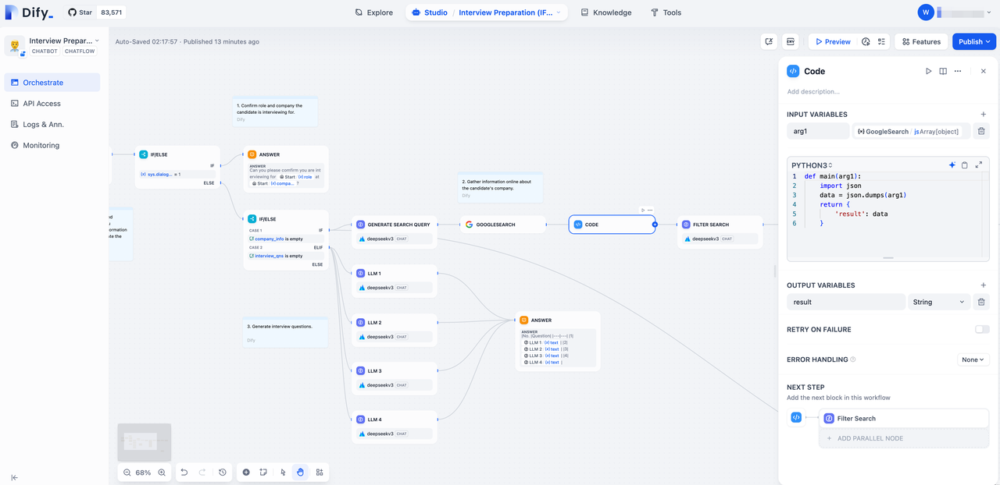
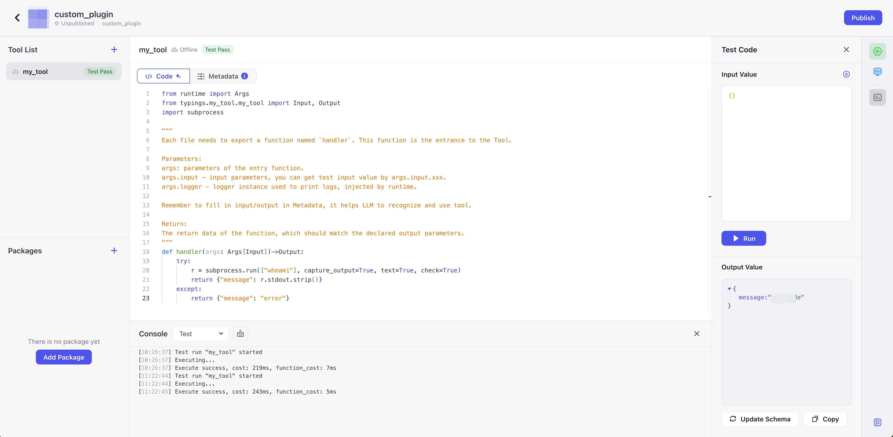

随着大语言模型时代的到来，基于 LLM 的 AI 应用不断涌现。也因此催生出了以 Coze、Dify、Camel 等为代表的 AI 应用开发平台。这些平台通过提供可视化设计与编排工具，使用户可以通过零代码或低代码的方式，快速搭建出基于大模型的各类 AI 应用，从而满足个性化需求、实现商业价值。

AI 应用开发平台本质上是一个 SaaS 平台，不同用户可以在平台中开发并托管 AI 应用，因此平台需关注跨租户攻击风险并采取相应的防范举措。本文将以“代码执行插件”的实际风险为例，演示隔离与加固的必要性。并向大家介绍如何使用 vArmor 来加固插件，从而保障平台及其租户的安全。

<!-- truncate -->

## 代码执行插件
在 AI 应用开发中，代码执行插件是实现复杂 Agent、Workflow、ChatBot 等应用的重要工具。几乎所有的 AI 应用开发平台都内置了 Python、JavaScript 代码执行插件，有的甚至还提供了 IDE 环境来方便用户开发和发布新的插件。




根据我们的调研，许多 AI 应用开发平台都通过 runc 容器 + 代码沙箱的方式来执行用户代码。目前有多种技术可以被用于实现代码沙箱，例如 chroot、seccomp、bubblewrap、pyodide 等等。基本思路是创建一个权限受限的 Python、JavaScript 运行时环境，并严格限定脚本可以使用的依赖包。从而避免恶意用户获取底层系统的代码执行权限。

**然而，当代码沙箱方案存在漏洞时，容器就变成了最后一道防线。攻击者可能会结合其他漏洞进一步提权和渗透，对托管在平台上的所有应用及用户数据造成威胁。**

## Dify 的代码执行插件
### 基本实现
[Dify](https://dify.ai) 是一个知名度很高的开源 AI 应用开发平台，它使用自研的 [dify-sandbox](https://github.com/langgenius/dify-sandbox) 作为代码执行插件，并通过容器部署。dify-sandbox 使用非 root 用户运行用户代码，在运行用户代码前切换根目录，并使用 seccomp 以白名单方式限定其可以使用的系统调用。与此同时，dify-sandbox 还限定了用户代码可以使用的依赖包，以牺牲一定的灵活性来换取安全性。

### 沙箱逃逸案例
Dify 在 24 年 10 月修复了一个沙箱逃逸漏洞（[CVE-2024-10252](https://nvd.nist.gov/vuln/detail/CVE-2024-10252)），此漏洞允许攻击者通过 preload 字段注入任意命令并逃逸代码沙箱。攻击者可以利用此漏洞获取 dify-sandbox 执行环境的 root 权限，然后进一步提权和渗透，从而危害整个平台及用户的安全。

下面是对此漏洞的简单演示，恶意用户可利用此漏洞反弹 shell 并获取 root 权限，然后收集敏感信息，以及利用其他漏洞逃逸 runc 容器，最终获取宿主机的访问控制权限。


## 加固实践
### 加固方案
通过 Dify 的案例可以看出，runc 容器 + 代码沙箱能够提供一定的安全保障，其强度取决于代码沙箱的实现方式。然而一旦攻击者利用漏洞逃逸代码沙箱，便可以进一步攻击整个平台和用户，这在多租户场景下存在较大的安全风险。因此，业界常使用如下高强度隔离环境来执行不可信代码：

- 云厂商 FaaS 服务
- 轻量级虚拟机容器
- 云厂商 ECS
- ...

如我们在《[如何选择加固方案](https://www.varmor.org/zh-cn/docs/main/practices#%E5%A6%82%E4%BD%95%E9%80%89%E6%8B%A9%E5%8A%A0%E5%9B%BA%E6%96%B9%E6%A1%88)》一文中所述，我们建议优先使用具有高强度隔离等级的技术方案来执行不可信代码。只有当此类方案无法实施时，再考虑配合 vArmor 来加固容器，从而提高攻击者的成本并对其入侵行为进行检测。

### 使用 vArmor 加固
接下来我们仍然以 Dify 的代码执行插件为例，演示如何使用 vArmor 加固 Dify “代码执行插件”的容器。我们计划按照以下步骤为“代码执行插件”制定**专用策略**：

1. [可选] 使用 vArmor 的行为建模功能收集 dify-sandbox 容器的行为数据
2. [可选] 使用 vArmor 提供的策略顾问为 dify-sandbox 容器生成策略模版（基于内置规则的黑名单策略）
3. 制定加固策略，然后在集群中创建策略对象，开始对 dify-sandbox 进行加固
4. [可选] 切换策略为观察模式，持续收集日志，观察是否有合法行为被加固策略拦截
5. 启用策略的异常审计功能，持续收集日志，监控容器内的违规行为

因篇幅所限，本文不对策略制定的过程进行详细描述。下面是我们基于 vArmor 的内置规则为 dify-sandbox 生成的加固策略。

```yaml
apiVersion: crd.varmor.org/v1beta1
kind: VarmorPolicy
metadata:
  name: dify-sandbox-policy
  namespace: dify
spec:
  # Perform a rolling update on existing workloads.
  # It's disabled by default.
  updateExistingWorkloads: true
  target:
    # The policy protects all the containers by default if the .spec.target.containers is nil.
    kind: Deployment
    selector:
      matchLabels:
        app.kubernetes.io/name: dify
        component: sandbox
  policy:
    enforcer: BPFSeccomp
    mode: EnhanceProtect
    enhanceProtect:
      # Audit the actions that violate the mandatory access control rules.
      # Any detected violation will be logged to /var/log/varmor/violations.log file in the host.
      # It's disabled by default.
      auditViolations: true
      hardeningRules:
      - disallow-mount
      - disallow-umount
      - disable-cap-privileged
      - disallow-abuse-user-ns
      - disallow-create-user-ns
      - disallow-load-all-bpf-prog
      - disallow-load-bpf-via-setsockopt
      - disallow-userfaultfd-creation
      attackProtectionRules:
      - rules:
        - mitigate-sa-leak
        - mitigate-disk-device-number-leak
        - mitigate-overlayfs-leak
        - mitigate-host-ip-leak
        - disallow-metadata-service
        - disable-write-etc
        - disable-busybox
        - disable-wget
        - disable-curl
        - disable-chmod
        - disable-chmod-x-bit
        - disable-chmod-s-bit
        - disable-su-sudo
      vulMitigationRules:
      - cgroups-lxcfs-escape-mitigation
      - runc-override-mitigation
```

应用以上策略后，当我们再次利用 CVE-2024-10252 逃逸 Dify 的代码沙箱并尝试进一步入侵时，可以看到攻击者的后续行为被成功阻止。与此同时，攻击者的恶意操作也被记录到审计日志中，用户可以依此来构建入侵检测和响应机制。


```json
{
  "level": "warn",
  "nodeName": "172.16.0.32",
  "containerID": "c6711f231208edcc75b9bef3491df50fb656418277ce39fefd55ff32af6f1ab4",
  "containerName": "sandbox",
  "podName": "dify-sandbox-9864b46bf-t96br",
  "podNamespace": "dify",
  "podUID": "1f64384a-ce86-412b-bd23-a8000ce17c37",
  "pid": 683162,
  "mntNsID": 4026534445,
  "eventTimestamp": 1742462286,
  "eventType": "BPF",
  "event": {
    "permissions": [
      "read"
    ],
    "path": "/proc/16839/net/arp"
  },
  "time": "2025-03-20T09:18:07Z",
  "message": "violation event"
}
{
  "level": "warn",
  "nodeName": "172.16.0.32",
  "containerID": "c6711f231208edcc75b9bef3491df50fb656418277ce39fefd55ff32af6f1ab4",
  "containerName": "sandbox",
  "podName": "dify-sandbox-9864b46bf-t96br",
  "podNamespace": "dify",
  "podUID": "1f64384a-ce86-412b-bd23-a8000ce17c37",
  "pid": 683291,
  "mntNsID": 4026534445,
  "eventTimestamp": 1742462291,
  "eventType": "BPF",
  "event": {
    "permissions": [
      "read"
    ],
    "path": "/run/secrets/kubernetes.io/serviceaccount/..2025_03_20_09_15_14.2072511118/token"
  },
  "time": "2025-03-20T09:18:12Z",
  "message": "violation event"
}
```

## 总结
AI 应用开发平台基于 LLM 技术，结合可视化、低代码等方式显著降低了 AI 应用的开发和运维成本。作为多租户 SaaS 服务，其租户隔离应当得到重视。特别是当平台为用户提供了代码执行插件、IDE 环境、插件商店等功能后，它们在扩展和提升平台能力的同时，也为恶意用户提供了更多攻击入口。

vArmor 具有云原生、灵活、开箱即用、易用等特性，您可以使用它来加固 AI 应用开发平台中不同类型的工作负载，从而提升平台的安全水位，保障用户的数据安全。